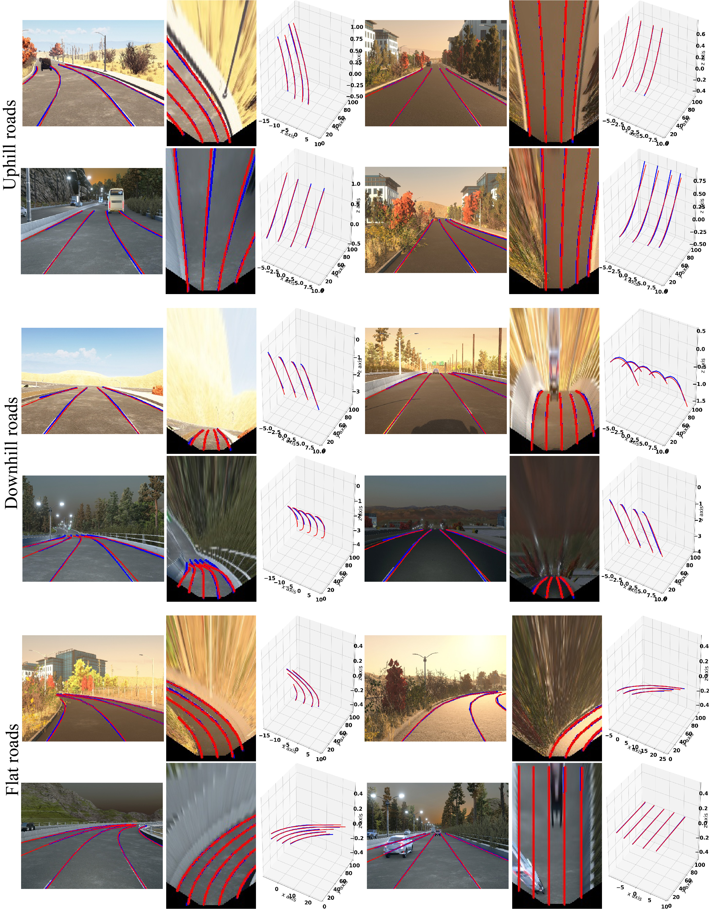

**3DLSCP**: Learning to Predict 3D Lane Shape and Camera Pose from a Single Image via Geometry Constraints
=======

* Predicting 3D lanes and camera pose from a single image.
* Learning via geometry constraints to improve performances on both tasks.
* This work has been accepted by AAAI2022.




## Model Zoo
The pretrained models are stored in 3DLSCPTRZoos/

## Set Envirionment

* Linux ubuntu 16.04
* GeForce RTX 3090
* Python 3.8.5
* CUDA 11.1

Create virtualenv environment

```
python3 -m venv 3dlscptr
```

Activate it

```
source 3dlscptr/bin/activate
```

Then install dependencies

```
pip install torch==1.8.1+cu111 torchvision==0.9.1+cu111 torchaudio==0.8.1 -f https://download.pytorch.org/whl/torch_stable.html
pip install -r requirements.txt
```

## Data Preparation
Download and extract ApolloSim from [yuliangguo/3D_Lane_Synthetic_Dataset](https://github.com/yuliangguo/3D_Lane_Synthetic_Dataset)

We expect the directory structure to be the following:
```
3dlscptr/
3DLSCPTR/
3DLSCPTRZoos/
Apollo_Sim_3D_Lane_Release/
```

## Evaluation

Pv-stage:

(1) Balanced scenes

```
python test.py Pv-stage_standard
```

(2) Rarely observed scenes

```
python test.py Pv-stage_rare_subset
```

(3) Scenes with visual variations

```
python test.py Pv-stage_illus_chg
```

Tv-stage:

(1) Balanced scenes

```
python test.py Tv-stage_standard
```

(2) Rarely observed scenes

```
python test.py Tv-stage_rare_subset
```

(3) Scenes with visual variations

```
python test.py Tv-stage_illus_chg
```

Pv-Tv (Firstly, you must run three commands of Pv-stage to get predicted camera poses!):

(1) Balanced scenes

```
python test.py Tv-stage_standard --predcam
```

(2) Rarely observed scenes

```
python test.py Tv-stage_rare_subset --predcam
```

(3) Scenes with visual variations

```
python test.py Tv-stage_illus_chg --predcam
```

## Evaluation results

|Scene|Method        |GTCP|Height(cm)|Pitch(o)|F-Score|AP  |X error near|X error far|Z error near|Z error far|
|-----|--------------|----|----------|--------|-------|----|------------|-----------|------------|-----------|
|   |3D-LaneNet    |Yes |          |        |86.4   |89.3|0.068       |0.477      |0.015       |0.202      |
|Balanced     |Gen-LaneNet   |Yes |          |        |88.1   |90.1|0.061       |0.496      |0.012       |0.214      |
|Scenes     |Pv-stage(ours)|No  |**0.031**     |**0.136**   |88.5   |90.4|0.095       |0.477      |0.040       |0.277      |
|     |Pv-Tv(ours)   |No  |0.031     |0.136   |**89.5**   |**91.3**|0.091       |0.450      |0.041       |0.281      |
|     |3D-LaneNet    |Yes |          |        |72.0   |74.6|0.166       |0.855      |0.039       |0.521      |
| Rarely Observed    |Gen-LaneNet   |Yes |          |        |78.0   |79.0|0.139       |0.903      |0.030       |0.539      |
| Scenes    |Pv-stage(ours)|No  |**0.069**     |**0.295**   |75.1   |76.5|0.210       |0.906      |0.084       |0.652      |
|     |Pv-Tv(ours)   |No  |0.069     |0.295   |**79.7**   |**81.4**|0.207       |0.860      |0.092       |0.661      |
|     |3D-LaneNet    |Yes |          |        |72.5   |74.9|0.115       |0.601      |0.032       |0.230      |
|  Scenes with   |Gen-LaneNet   |Yes |          |        |85.3   |87.2|0.074       |0.538      |0.015       |0.232      |
|  visual variations   |Pv-stage(ours)|No  |**0.078**     |**0.164**   |**85.8**   |**87.5**|0.091       |0.523      |0.050       |0.330      |
|     |Pv-Tv(ours)   |No  |0.078     |0.164   |84.9   |86.6|0.103       |0.501      |0.050       |0.308      |

Comparisons of the upper bounds. All methods are fed with perfect camera poses during testing phase. GTSeg means the requirement of ground truth lane segmentation.

|Scene             |Method        |GTSeg|F-Score|AP  |
|------------------|--------------|-----|-------|----|
|                  |3D-LaneNet    |No   |86.4   |89.3|
| Balanced         |Gen-LaneNet   |No   |88.1   |90.1|
| Scenes           |3D-GeoNet     |Yes  |91.8   |93.8|
|                  |Tv-stage(ours)|No   |90.7   |92.6|
|                  |3D-LaneNet    |No   |72.0   |74.6|
| Rarely Observed  |Gen-LaneNet   |No   |78.0   |79.0|
| Scenes           |3D-GoeNet     |Yes  |84.7   |86.6|
|                  |Tv-stage(ours)|No   |85.7   |87.8|
|                  |3D-LaneNet    |No   |72.5   |74.9|
| Scenes with      |Gen-LaneNet   |No   |85.3   |87.2|
| visual variations|3D-GeoNet     |Yes  |90.2   |92.3|
|                  |Tv-stage(ours)|No   |86.1   |88.0|

Comparisons of resource consumption. 1 MAC is approx. 2 FLOPs. PP means the requirement of post processing.

|Method     |FPS|MACs(G)|Para(M)|PP |
|-----------|---|-------|-------|---|
|3D-LaneNet |53 |60.47  |20.6   |Yes|
|Gen-LaneNet|60 |9.85   |3.4    |Yes|
|Pv-Tv(ours)|75 |0.861  |1.5    |No |


## Training

Corresponding codes will be released after acceptance.

## Acknowledgements

[Gen-LaneNet](https://github.com/yuliangguo/Pytorch_Generalized_3D_Lane_Detection)

[LSTR](https://github.com/liuruijin17/LSTR)
